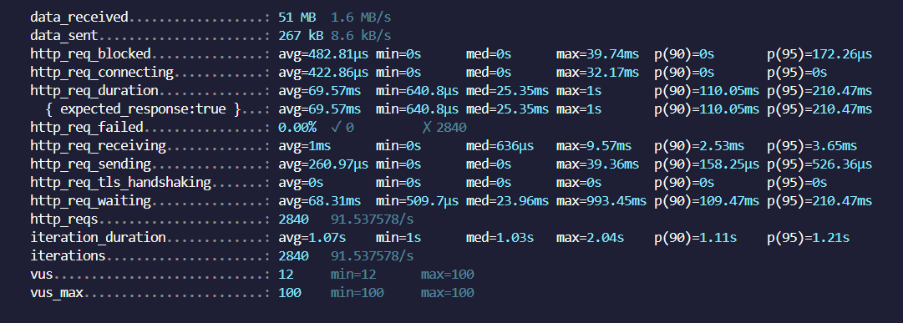
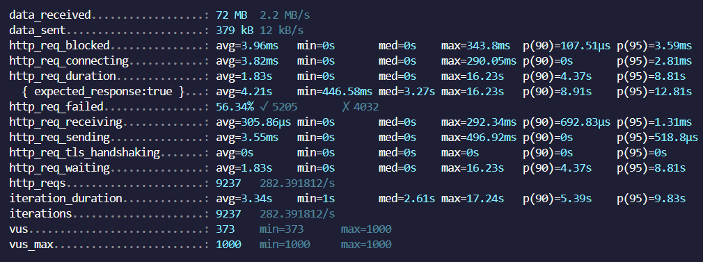

# Ponderada K6 - Semana 7 Módulo 9

O k6 é uma ferramenta de teste de carga eficaz e fácil de usar, projetada para avaliar a performance de aplicações web e serviços sob condições de tráfego intenso. Nesse contexto, sua simplicidade e eficiência permitem que desenvolvedores e equipes de QA testem rapidamente a capacidade dos sistemas de suportar altos volumes de acesso, assegurando assim a confiabilidade e o alto desempenho das aplicações em momentos críticos. Logo, ao identificar proativamente gargalos e potenciais problemas de performance, o k6 desempenha um papel fundamental na manutenção da qualidade da experiência do usuário e na otimização dos recursos operacionais.

## Conceitos aprendidos

Durante o desenvolvimento da ponderada, foi possível aprofundar nos testes de carga e como utilizá-los em cenários reais, bem como ter claro sua importância no processo de aprimoramento e construção de sistemas com maior qualidade e eficiência.

## K6 no contexto do projeto

O k6 assume papel fundamental no projeto em parceria com a Track.co, haja vista que auxilia na construção e garantia de um sistema de testes automatizados robusto e eficiente, garantindo, assim, a qualidade da plataforma da startup. Nesse cenário, os testes de carga podem gerar insights valiosos, bem como a identificação de possíveis gargalos na plataforma que estejam afetando de forma negativa o desempenho e a entrega da Track aos clientes. 

## Teste com K6

Para a ponderada, foi testado o endpoint de **Listagem das distribuições**, através da url ```http://localhost:8080/distrbuitions```. A seguir, estão algumas prints da execução do teste, partindo da definição de dois cenários:

**Cenário 1:** 100 requisições por segundo num período de 30 segundos.


### Resultados

Através da ```http_req_failed```, pudemos ver que 0% das requisições falharam. No entanto, é possível ver que ao invés de 100 requisições por segundo (como definido no código), o endpoint processou 91.5 requisições por segundo, o que representa um possível gargalo no projeto. Além disso, ```http_req_duration``` mostra que o tempo médio de duração das requisições foi de 69.57ms, o que representa um ótimo tempo.

**Cenário 2:** 1000 requisições por segundo num período
de 30 segundos.


### Resultados

Através da ```http_req_failed```, pudemos ver que, aproximadamente, 44% das requisições falharam, representando, assim, um possível ponto de melhoria para o grupo focar nas próximas sprints. Ademais, ````http_req_duration``` mostrou que o tempo médio de duração das requisições foi de 1.83s, o que mostra um aumento considerável se comparado com o primeiro cenário.
